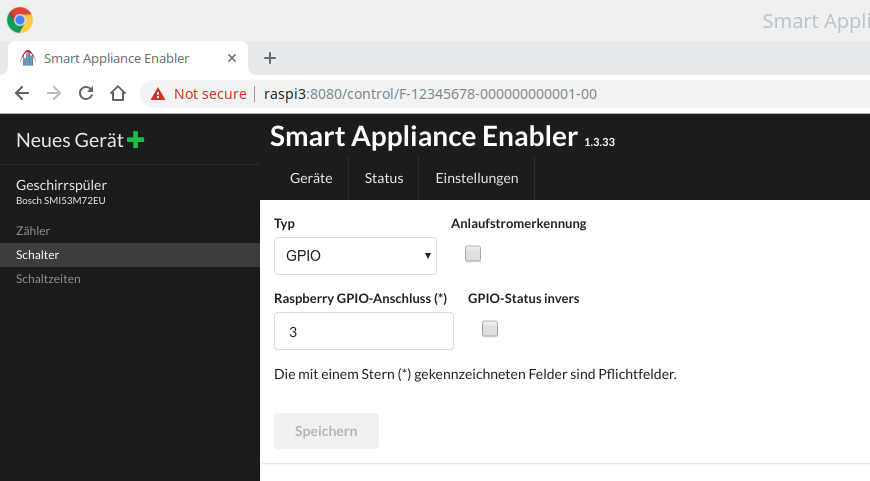

# GPIO-basiertes Schalten
Der Raspberry Pi verfügt über **GPIO-Anschlüsse** die ein- und ausgeschaltet werden können.
Dabei sollten unbedingt die Hinweise im Kapitel zum [Raspberry Pi](Raspberry_DE.md) beachtet werden, insbesondere auch zur **Numerierung der GPIO-Anschlüsse**.

Zur Konfiguration eines GPIO-basierten Schalters gehört die Nummer des GPIO-Anschlusses und die Angabe, ob der Schalter-Status invertiert werden soll.
Außerdem kann die [Anlaufstromerkennung](Anlaufstromerkennung_DE.md) aktiviert werden.



Wird ein Gerät über GPIO geschaltet, findet sich in der [Log-Datei](Support.md#Log) für jeden Schaltvorgang folgende Zeile:

```
2017-02-25 10:45:03,400 INFO [http-nio-8080-exec-2] d.a.s.a.Switch [Switch.java:56] F-00000001-000000000001-00: Switching on GPIO 4
```

## Solid-State-Relais
Zum Schalten von 240V-Geräten eignen sich [**Solid-State-Relais**](https://de.wikipedia.org/wiki/Relais#Halbleiterrelais). Diese gibt es ab ca. 5 Euro zu kaufen.

#### Schaltbeispiel 1: Schaltung eines 240V-Gerätes mittels Solid-State-Relais
Der Aufbau zum Schalten eines 240V-Gerätes (z.B. Pumpe) mittels Solid-State-Relais könnte wie folgt aussehen:


Zur Montage des Solid-State-Relais verwende ich [DIN-Schienenhalter](DINSchienenhalter.md), wobei ich auf der PVC-Montageplatte Gummi-Durchführungsringe als Abstandshalter mit Heißkleber befestigt habe. Die Muttern der Nylon-Schrauben zur Befestigung des Solid-State-Relais habe ich (anders als auf dem Foto zu sehen) nicht mehr vorn auf der Kunststoffplatte mit Heißkleber angeklebt, sondern auf der Rückseite. Der Grund dafür ist die Erwärmung der Metallseite des Solid-State-Relais, wodurch sich die mit Heißkleber auf der PVC-Platte befestigte Mutter lösen kann.


