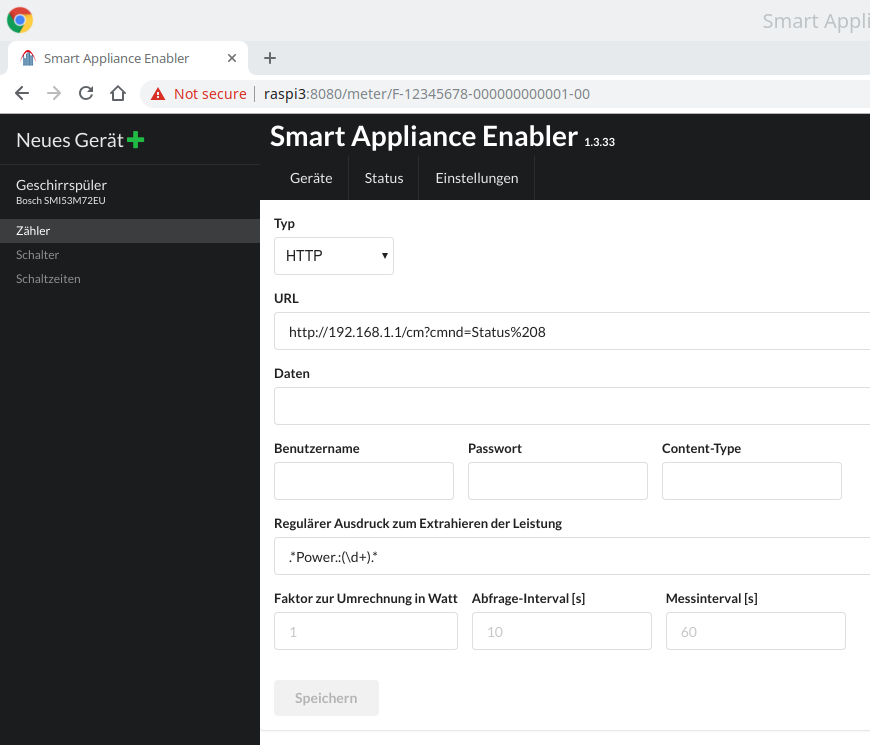

# HTTP-basierte Stromzähler

Für HTTP-basierte Stromzähler muss eine URL angegeben. Bei der Eingabe einer URL ist zu beachten, dass bei Angabe der URL bestimmte Sonderzeichen "encoded" angegeben werden müssen. Zum Beispiel muss anstatt des "&"-Zeichens der Ausruck ```"&amp;"``` (ohne Anführungszeichen) verwendet werden! Zum "encoden" von URLs kann man den Service [URL Encode online](https://www.urlencoder.io) verwenden.

Falls erforderlich, können Benutzername und Passwort für eine __Basic Authentication__ angegeben werden.

Wenn nicht nur eine Zahl für den Verbrauchswert geliefert wird, sondern der Verbrauchswert irgendwo in einem Text (XML, JSON, ...) enthalten ist, muss ein [Regulärer Ausdruck zum Extrahieren](WertExtraktion_DE.md) der Leistung ein angegeben werden.

Falls der über HTTP gelieferte Verbrauchswert nicht in Watt geliefert wird, muss ein ```Faktor zur Umrechnung in Watt``` angegeben werden, mit dem der gelieferte Wert multipliziert werden muss, um den Verbrauch in Watt zu erhalten. Wird beispielsweise der Verbrauch in mW geliefert, muss dieser Faktor mit dem Wert ```1000``` angegeben werden.

Der ```Abfrage-Intervall``` legt fest, in welchen Abständen die aktuelle Leistungsaufnahme bei der Datenquelle abgefragt wird.

Der ```Messinterval``` wird verwendet, um die durchschnittliche Leistungsaufnahme berechnen.



Wird ein Zähler über HTTP abgefragt, finden sich in der [Log-Datei](Support.md#Log) für jede Abfrage folgende Zeilen:

```
2017-06-03 18:39:55,125 DEBUG [Timer-0] d.a.s.a.HttpTransactionExecutor [HttpTransactionExecutor.java:101] F-00000001-000000000001-00: Sending HTTP request
2017-06-03 18:39:55,125 DEBUG [Timer-0] d.a.s.a.HttpTransactionExecutor [HttpTransactionExecutor.java:102] F-00000001-000000000001-00: url=http://192.168.1.1/cm?cmnd=Status%208
2017-06-03 18:39:55,126 DEBUG [Timer-0] d.a.s.a.HttpTransactionExecutor [HttpTransactionExecutor.java:103] F-00000001-000000000001-00: data=null
2017-06-03 18:39:55,126 DEBUG [Timer-0] d.a.s.a.HttpTransactionExecutor [HttpTransactionExecutor.java:104] F-00000001-000000000001-00: contentType=null
2017-06-03 18:39:55,126 DEBUG [Timer-0] d.a.s.a.HttpTransactionExecutor [HttpTransactionExecutor.java:105] F-00000001-000000000001-00: username=null
2017-06-03 18:39:55,126 DEBUG [Timer-0] d.a.s.a.HttpTransactionExecutor [HttpTransactionExecutor.java:106] F-00000001-000000000001-00: password=null
2017-06-03 18:39:55,146 DEBUG [Timer-0] d.a.s.a.HttpTransactionExecutor [HttpTransactionExecutor.java:118] F-00000001-000000000001-00: Response code is 200
2017-06-03 18:39:55,147 DEBUG [Timer-0] d.a.s.a.HttpElectricityMeter [HttpElectricityMeter.java:119] F-00000001-000000000001-00: HTTP response: STATUS8 = {"StatusPWR":{"Total":0.000, "Yesterday":0.000, "Today":0.000, "Power":26, "Factor":0.94, "Voltage":234, "Current":0.122}}
2017-06-03 18:39:55,147 DEBUG [Timer-0] d.a.s.a.HttpElectricityMeter [HttpElectricityMeter.java:120] F-00000001-000000000001-00: Power value extraction regex: .*Power.:(\d+).*
2017-06-03 18:39:55,153 DEBUG [Timer-0] d.a.s.a.HttpElectricityMeter [HttpElectricityMeter.java:119] F-00000001-000000000001-00: Power value extracted from HTTP response: 26
```
