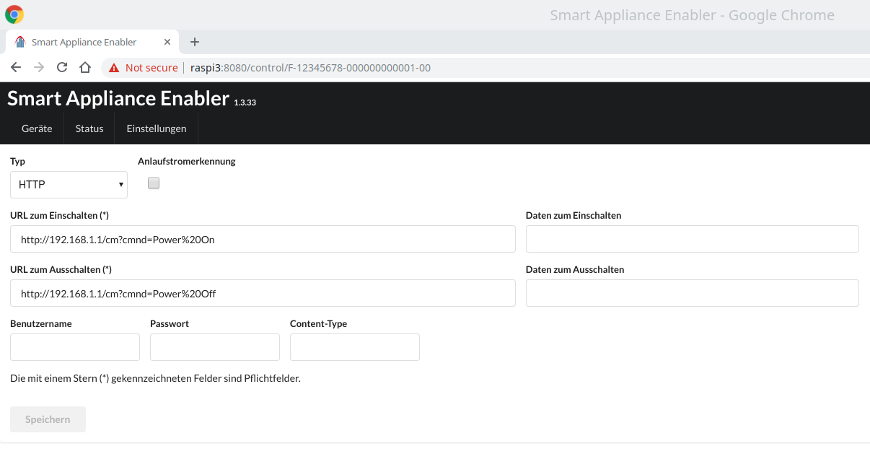

# HTTP-basierte Schalter

Für HTTP-basierte Schalter kann eine URL zum Einschalten und eine weitere URL zum Ausschalten angegeben werden. Für beide URLs lassen sich Daten angeben, die mit der Anfrage gesendet werden. Wenn Daten angegeben werden, sollte auch der Content-Type dieser Daten in dem entsprechenden Eingabefeld angegeben werden.

Falls erforderlich, können Benutzername und Passwort für eine __Basic Authentication__ angegeben werden.

Bei der Eingabe einer URL ist zu beachten, dass bei Angabe der URL bestimmte Sonderzeichen "encoded" angegeben werden müssen. Zum Beispiel muss anstatt des "&"-Zeichens der Ausruck ```"&amp;"``` (ohne Anführungszeichen) verwendet werden! Zum "encoden" von URLs kann https://coderstoolbox.net/string/#!encoding=url&action=encode&charset=us_ascii verwendet werden.



Wird ein Gerät über HTTP geschaltet, finden sich in der [Log-Datei](Support.md#Log) für jeden Schaltvorgang folgende Zeilen:
```
2017-06-03 18:39:52,143 DEBUG [http-nio-8080-exec-1] d.a.s.s.w.SempController [SempController.java:192] F-00000001-000000000001-00: Received control request
2017-06-03 18:39:52,145 DEBUG [http-nio-8080-exec-1] d.a.s.a.HttpTransactionExecutor [HttpTransactionExecutor.java:101] F-00000001-000000000001-00: Sending HTTP request
2017-06-03 18:39:52,145 DEBUG [http-nio-8080-exec-1] d.a.s.a.HttpTransactionExecutor [HttpTransactionExecutor.java:102] F-00000001-000000000001-00: url=http://192.168.1.1/cm?cmnd=Power%20On
2017-06-03 18:39:52,145 DEBUG [http-nio-8080-exec-1] d.a.s.a.HttpTransactionExecutor [HttpTransactionExecutor.java:103] F-00000001-000000000001-00: data=null
2017-06-03 18:39:52,145 DEBUG [http-nio-8080-exec-1] d.a.s.a.HttpTransactionExecutor [HttpTransactionExecutor.java:104] F-00000001-000000000001-00: contentType=null
2017-06-03 18:39:52,145 DEBUG [http-nio-8080-exec-1] d.a.s.a.HttpTransactionExecutor [HttpTransactionExecutor.java:105] F-00000001-000000000001-00: username=null
2017-06-03 18:39:52,145 DEBUG [http-nio-8080-exec-1] d.a.s.a.HttpTransactionExecutor [HttpTransactionExecutor.java:106] F-00000001-000000000001-00: password=null
2017-06-03 18:39:52,163 DEBUG [http-nio-8080-exec-1] d.a.s.a.HttpTransactionExecutor [HttpTransactionExecutor.java:118] F-00000001-000000000001-00: Response code is 200
2017-06-03 18:39:52,163 DEBUG [http-nio-8080-exec-1] d.a.s.a.Appliance [Appliance.java:318] F-00000001-000000000001-00: Control state has changed to on: runningTimeMonitor=not null
2017-06-03 18:39:52,165 DEBUG [http-nio-8080-exec-1] d.a.s.s.w.SempController [SempController.java:214] F-00000001-000000000001-00: Setting appliance state to ON
```

## Auswahl geeigneter Schalter
Von den nachfolgend aufgeführten Produkten ist bekannt, dass sie mit dem *Smart Appliance Enabler* eingesetzt werden.
Hinweise zur Konfiguration finden sich ebenfalls auf diesen Seiten.

* [Sonoff Pow](doc/SonoffPow_DE.md)
* [Edimax SP-2101W](doc/EdimaxSP2101W_DE.md)
* [Shelly 4 Pro](doc/Shelly4Pro_DE.md)