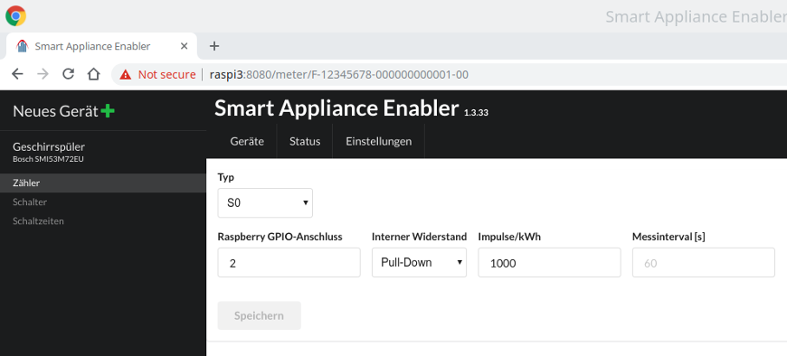

# Digitale Stromzähler mit S0-Ausgang

Der Raspberry Pi verfügt über **GPIO-Anschlüsse**, an denen Impulse eines digitalen Stromzählers mit S0-Ausgang ausgewertet werden können.
Dabei sollten unbedingt die Hinweise im Kapitel zum [Raspberry Pi](Raspberry_DE.md) beachtet werden, insbesondere auch zur **Numerierung der GPIO-Anschlüsse**.

Zur Konfiguration eines S0-Stromzählers gehört die Nummer des GPIO-Anschlusses, die Konfiguration des internen Widerstands (Pull up / Pull down) sowie die Anzahl der Impulse pro kWh.

Ausserdem kann ein ```Messinterval``` angegeben werden für die Durchschnittsberechnung der Leistungsaufnahme.

Für die Genauigkeit des Zählers ist die Anzahl der Impulse pro kWh wichtig. Die meisten aktuellen Zähler bieten hier 1000imp. Persönlich bin ich sehr zufrieden mit den Zählern von [B+G E-Tech](http://www.bg-etech.de/), die zudem recht günstig sind.



Wird ein S0-Zähler verwendet, finden sich in der [Log-Datei](Support.md#Log) für jede empfangenen Impuls folgende Zeilen:
```
2017-04-03 09:42:23,123 DEBUG [pi4j-gpio-event-executor-1358] d.a.s.a.S0ElectricityMeter [S0ElectricityMeter.java:92] F-00000001-000000000001-00: GPIO "GPIO 0" <GPIO 0> changed to HIGH
2017-04-03 09:42:23,133 DEBUG [pi4j-gpio-event-executor-1358] d.a.s.a.PulseElectricityMeter [PulseElectricityMeter.java:363] F-00000001-000000000001-00: timestamps added/removed/total: 1/361/1
2017-04-03 09:42:23,188 DEBUG [pi4j-gpio-event-executor-1358] d.a.s.a.S0ElectricityMeter [S0ElectricityMeter.java:92] F-00000001-000000000001-00: GPIO "GPIO 0" <GPIO 0> changed to LOW
```

In den Schaltbeispielen ist der für den Stromzähler notwendige **Pull-Down-Widerstand** nicht eingezeichnet, weil dafür die auf dem Raspberry Pi vorhandenen Pull-Down-Widerstände per Software-Konfiguration aktiviert werden.

## Schaltbeispiel 1: 240V-Gerät mit Stromverbrauchsmessung
Der Aufbau zum Messen des Stromverbrauchs eines 240V-Gerätes (z.B. Pumpe) könnte wie folgt aussehen, wobei diese Schaltung natürlich um einen [Schalter](https://github.com/camueller/SmartApplianceEnabler/blob/master/README.md#schalter) erweitert werden kann, wenn neben dem Messen auch geschaltet werden soll.


