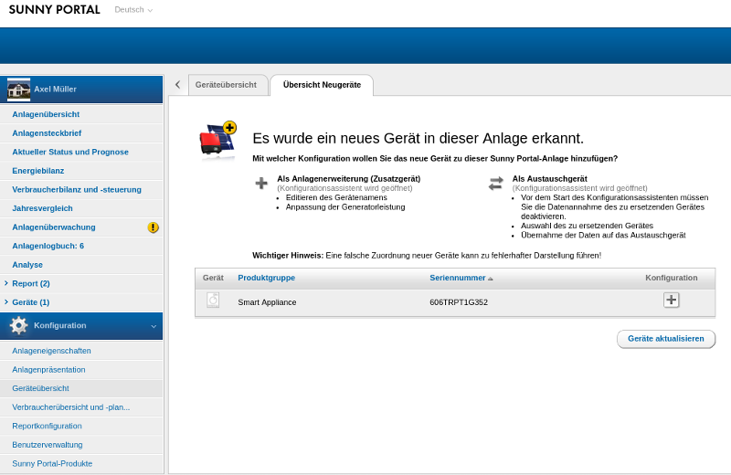
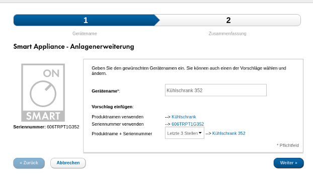
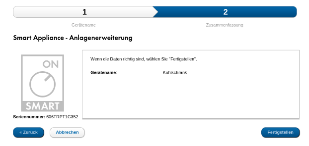
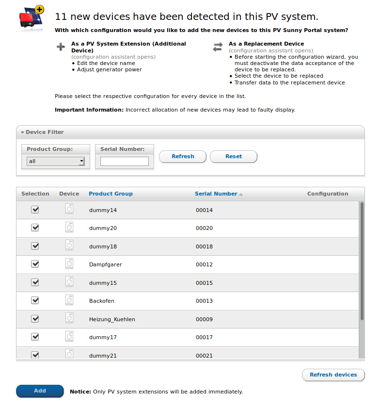
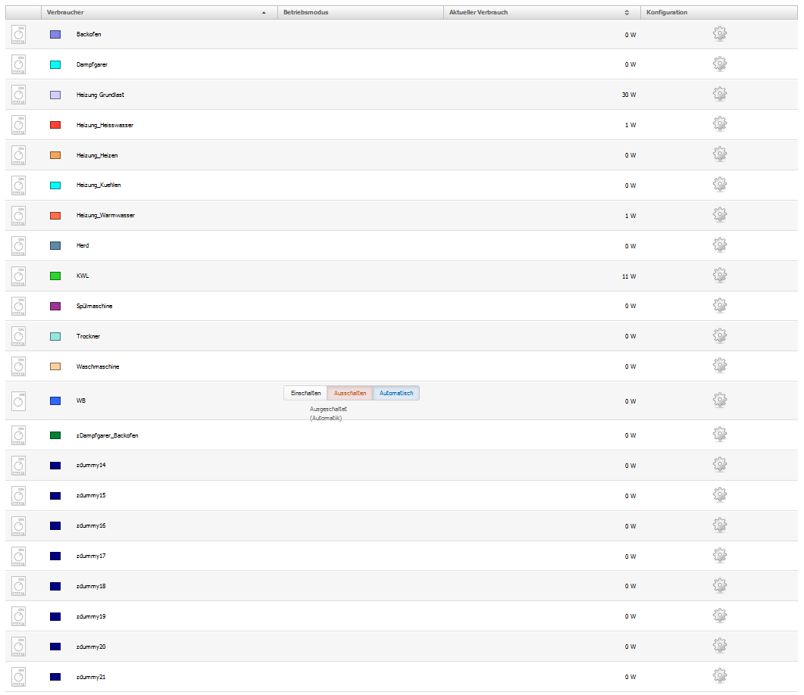

# Integration in den Sunny Home Manager (SHM)
Zum Hinzufügen neuer Geräte in den Sunny Home Manager muss auf der Seite
```
Konfiguration -> Geräteübersicht -> Tab: Übersicht Neugeräte
```
der Button ```Geräte aktualisieren``` gedrückt werden. Danach sollte das neu konfigurierte Gerät angezeigt werden:



Durch Drücken des ```[+]```-Buttons wird das Gerät hinzugefügt.
Im ersten Schritt kann der Gerätename festgelegt werden - die Vorgabe kommt aus der Konfiguration des Gerätes im *Smart Appliance Enabler*:



Im zweiten Schritt wird lediglich eine Zusammenfassung angezeigt:


Nach Drücken von ```Fertigstellen``` wird noch eine Bestätigung angezeigt, dass das Gerät hinzugefügt wurde.

Der SHM fragt den *Smart Appliance Enabler* alle 60 Sekunden nach dem Status der verwaltenden Geräte zugehörigen Schaltzeiten. In der [Log-Datei](Support.md#Log) sollten für jede Abfrage in etwa folgende Zeilen stehen: 
```
2019-03-30 00:00:55,154 DEBUG [http-nio-8080-exec-5] d.a.s.s.w.SempController [SempController.java:55] Device info/status/planning requested.
2019-03-30 00:00:55,156 DEBUG [http-nio-8080-exec-5] d.a.s.s.w.SempController [SempController.java:218] F-00000001-000000000001-00: Reporting device status based on power consumption
2019-03-30 00:00:55,158 DEBUG [http-nio-8080-exec-5] d.a.s.s.w.SempController [SempController.java:229] F-00000001-000000000001-00: DeviceStatus{eMSignalsAccepted=false, status=Off, errorCode=null}
2019-03-30 00:00:55,160 DEBUG [http-nio-8080-exec-5] d.a.s.s.w.SempController [SempController.java:233] F-00000001-000000000001-00: Reporting power info from meter.
2019-03-30 00:00:55,161 DEBUG [http-nio-8080-exec-5] d.a.s.m.PulseElectricityMeter [PulseElectricityMeter.java:234] F-00000001-000000000001-00: 0 timestamps in measurement interval
2019-03-30 00:00:55,163 DEBUG [http-nio-8080-exec-5] d.a.s.m.PulseElectricityMeter [PulseElectricityMeter.java:125] F-00000001-000000000001-00: Not switched on.
2019-03-30 00:00:55,173 DEBUG [http-nio-8080-exec-5] d.a.s.s.w.SempController [SempController.java:251] F-00000001-000000000001-00: PowerInfo{averagePower=0, minPower=0, maxPower=0, timestamp=0, averagingInterval=60}
2019-03-30 00:00:55,174 DEBUG [http-nio-8080-exec-5] d.a.s.s.w.SempController [SempController.java:274] F-00000001-000000000001-00: No planning requests created
```

In der Verbraucherbilanz sollte ab jetzt das neue Gerät aufgeführt werden mit seinem Verbrauch:


Aktuell unterstützt der Sunny Home Manager maximal 24 Geräte die gemessen werden (kein Schalter konfiguriert), davon dürfen maximal 12 Geräte mit aktivem Energiemanagement sein (Schalter ist konfiguriert). Zur Gesamtzahl zählen neben den Geräten, die mit dem SEMP Protokoll angesprochen werden, auch z.B. SMA Bluetooth Funksteckdosen - also alle Geräte, die im Sunny Portal in der Verbraucherübersicht angezeigt werden. Wird die zulässige Höchstzahl überschritten, wird das neu angelegte Gerät im Sunny Portal angezeigt, kann jedoch nicht hinzugefügt werden (gelbes Ausrufezeichen, Fehlermeldung "Weder eine Erweiterung noch ein Austausch ist in dieser Geräteklasse möglich").
Aktuell ist es nicht möglich im Portal mehr als 12 Geräte anzulegen, wenn diese "nach und nach" einzeln angelegt werden. Es ist dabei unerheblich, ob die Geräte nur messen oder auch schalten. Es handelt sich hierbei vermutlich um einen Bug in der Weboberfläche.

Folgender Workaround funktioniert jedoch:
Zuerst müsst ihr unter die 12 Geräte kommen, das ist möglicherweise mit Datenverlust verbunden (wenn ihr schon 12 Geräte habt und eines löschen müsst). Anschließend die gewünschte Anzahl von Geräten im SAE anlegen. Plant hierbei unbedingt spätere Erweiterungen gleich mit ein, denn nachträglich müsstet ihr erst wieder unter die 12 Geräte kommen um neue anlegen zu können. Ein bereits angelegtes aber noch nicht benutztes Gerät kann nachträglich noch umbenannt werden - es wird über die eindeutige ID identifiziert.

Wenn im *Smart Appliance Enabler* alle Geräte angelegt sind können diese in einem Rutsch mit dem Pluszeichen hinzugefügt werden, dazu bei jedem Gerät den Haken setzen:




Achtung: Danach darf kein Gerät über das Portal inaktiv geschaltet werden, es lässt sich nicht mehr aktivieren. Soll ein Gerät temporär nicht geschalten werden im *Smart Appliance Enabler* einfach das Zeitfenster ausschalten.

Übersicht einer Anlage mit 22 Verbrauchern, für spätere Erweiterungen wurden Dummys angelegt:


